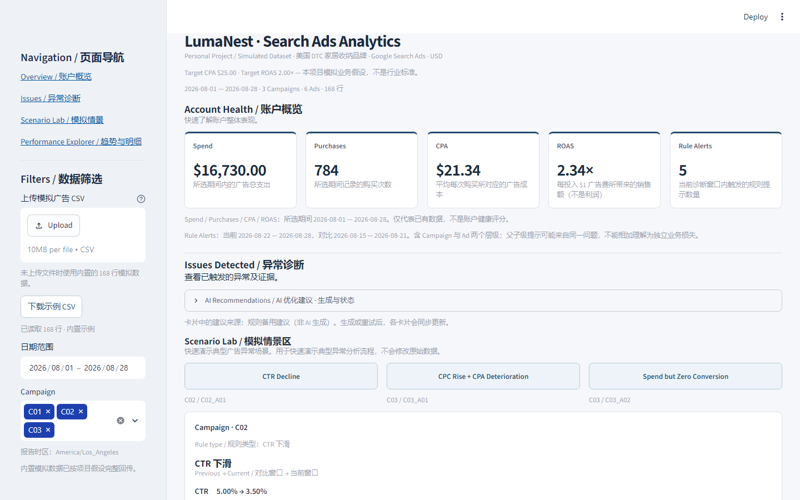
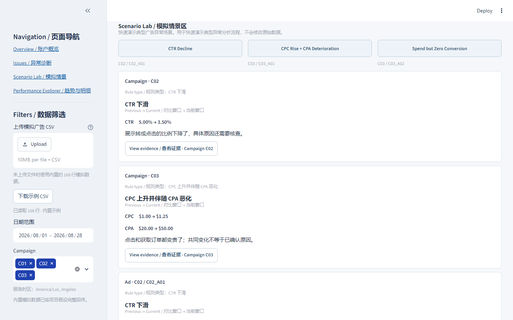
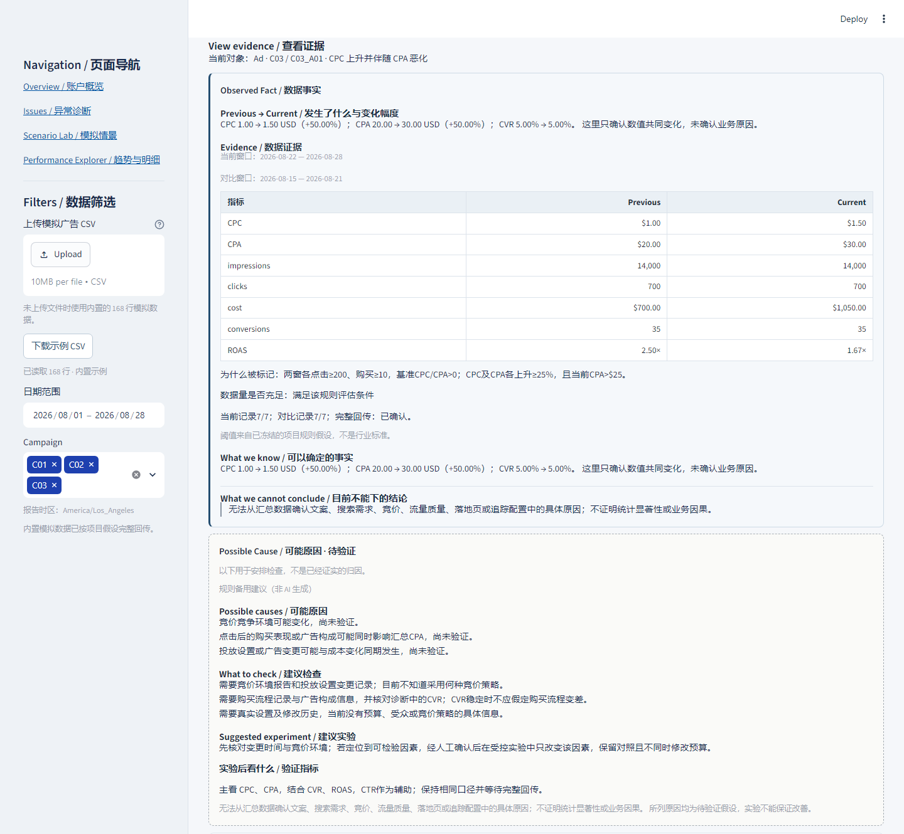

# LumaNest · Search Ads Analytics

**Personal Project / Simulated Dataset**

基于模拟 Google Search Ads 数据，展示“发现异常 → 查看证据 → 判断边界 → 安排核查与实验”的广告分析流程。


*账户概览与异常入口：从整体表现进入证据，而非仅展示指标。*

虚构美国 DTC 家居收纳品牌；28 天 × 3 Campaigns × 2 Ads = 168 行，USD、线上购买。Target CPA **$25**、Target ROAS **2.0x**、每单 **$50** 均为模拟业务假设，不是行业标准。**本项目不代表真实广告账户经验或实际投放收益。**

## What I Built

- **Performance Dashboard：** 上传校验、指标汇总与 Campaign / Ad 趋势明细。
- **分层异常诊断：** 规则检测、窗口证据与数据不足提示，避免把整体表现套到单条广告。
- **受约束 AI 建议：** 将事实、原因假设、检查项与实验分开呈现。
- **Scenario Lab 与导航：** 三个案例一键展开对应诊断，不改变数据。


*点击案例进入既有诊断，体验从异常到证据的分析路径。*

## Three Key Scenarios

统一对比 **2026-08-15—21 → 2026-08-22—28**。模拟数据用于验证流程，不模拟真实竞价或季节性。

### CTR Decline · C02_A01

- **Observed Fact：** CTR 5.00% → 2.00%（−60%）；CPA $20、ROAS 2.50x 保持稳定，但点击 **700 → 280**、购买 **35 → 14**。效率稳定不代表规模未受影响。
- **判断边界：** 可以确认点击率与购买规模下降，不能直接认定文案失效或竞争加剧。
- **Possible Cause / 下一步：** 广告相关性或展示构成变化仅是假设；核查文案历史、展示位置及设备/时间分层，继续确认 clicks / purchases 的规模变化。文案实验测试改善效果，不证明原始原因。

### CPC Rise + CPA Deterioration · C03_A01

- **Observed Fact：** CPC $1.00 → $1.50、CPA $20 → $30（均 +50%），CVR 稳定在 5.00%；ROAS 2.50x → 1.67x。**CPA 高于 $25 target，ROAS 低于 2.0x target。**
- **判断边界：** 同量点击与购买对应的成本增加，但不能确认竞价或竞争变化是原因，也不能断言购买流程变差。
- **Possible Cause / 下一步：** 核查竞价环境与设置修改记录；有证据后再安排单变量对照实验，结合 CPC、CPA、CVR 与 ROAS 验证。

### Spend but Zero Conversion · C03_A02

- **Observed Fact：** 花费 $700、点击 700 不变；购买 35 → 0，CPA $20 → **N/A**，ROAS 2.50x → 0.00x。
- **判断边界：** 当前完整窗口有花费但无购买记录，不证明实际没有订单或追踪故障；零购买时不计算 CPA 百分比变化。
- **Possible Cause / 下一步：** 先核对订单后台、购买事件及回传，再检查结账和支付路径。测量可靠前只做核查，不直接建议暂停广告。


*C03_A01：Previous → Current、Observed Fact、判断边界与核查/实验建议；本图展示规则备用建议（非 AI 生成），真实模型能力与约束见下文。*

## AI Guardrails

**Observed Fact ≠ Possible Cause。** 规则提示用于启动调查，不是因果结论。

AI 仅接收结构化诊断，从审定的“假设—检查—实验”候选组合中选择和排序；不读原始 CSV、不重算数字，不自由编造搜索词、素材、竞价策略或落地页事实。它提供 **evidence-based optimization recommendations**，不是自主投放系统；建议范围受候选库限制。

数据不足只给检查建议；正常对照不制造问题。不自动暂停广告、不提供武断预算比例，不把模拟结果当作真实成果。API 不可用时仍可查看诊断和明确标注的规则备用建议。

## Tech Stack

**Python · Streamlit · Pandas · Plotly · DeepSeek API · OpenAI Python SDK**

Pandas 处理指标与汇总，确定性规则提供诊断，DeepSeek 进行受约束建议选择，Streamlit / Plotly 展示证据与交互。

<details>
<summary>Portfolio Summary · 中英文项目简介</summary>

基于虚构电商品牌的模拟数据，构建 Google 搜索广告分析助手，串联“发现异常、查看证据、判断边界、安排核查与实验”流程。实现分层诊断与受约束 AI 建议，区分数据事实和原因假设，展示业务分析能力，不代表真实投放经历。

Built a Google Search Ads analysis assistant using simulated data for a fictional e-commerce brand. Connected anomaly detection, evidence review, interpretation boundaries, and follow-up checks and experiments. Implemented Campaign/Ad-level diagnostics and constrained AI assistance for evidence-based optimization recommendations. This personal project does not represent real advertising account experience.

</details>

## Technical Details / Run & Test

<details>
<summary>指标公式、完整规则与数据边界</summary>

**Observed Fact ≠ Possible Cause。** 规则提示用于启动调查，不是自动归因或自动投放指令。

- **统一计算口径：** 所有层级先累加原始值，再计算比率，不平均行级 CTR、CPA 或 ROAS。CTR = clicks / impressions；CPC = cost / clicks；CPM = cost / impressions × 1,000；CVR = conversions / clicks；CPA = cost / conversions；ROAS = conversion_value / cost。CTR、CVR 展示为百分比。
- **数据先于结论：** 零分母显示 N/A；零购买却有正购买金额会阻止分析。缺失记录不补成真实 0，部分缺失日期的趋势断开；无法识别整个文件中从未出现过的 Ad。
- **明确判断条件：** 当前窗口由筛选结束日确定，向前取七天并对比之前七天；对比数据不受筛选开始日裁剪。完整性、回传声明、最低样本量与多项指标共同限定结论，未触发异常不等于账户健康。
- **提示不等于独立问题：** Rule Alerts 按已触发规则记录计数，Campaign / Ad 父子级提示可能来自同一问题；不相加解释为独立损失。

| 规则 | 项目判断条件（不是行业标准） |
| --- | --- |
| CTR 下滑 | 双窗完整、各至少 1,000 展示与 50 点击，基准 CTR > 0；CTR 相对下降至少 30% |
| CPC / CPA 恶化 | 双窗完整、各至少 200 点击与 10 购买，基准 CPC / CPA > 0；二者均上升至少 25%，且当前 CPA > $25 |
| 零转化 | 当前完整七天花费至少 $50、点击至少 50、购买为 0；不要求完整对比窗口 |
| 正常对照 | 相关规则可评估、无已定义异常，且 CPA ≤ $25、ROAS ≥ 2.0x |

诊断依赖完整回传确认；缺失或样本不足时只标记数据不足，不强行下结论。最低样本门槛不代表统计显著性。


报告时区 America/Los_Angeles；模拟 7 天点击归因、按点击日期记录。示例覆盖 2026-08-01—28，2026-09-05 冻结，假设完整回传。不能仅凭 CSV 核实归因。固定每单 $50 只适用于示例，不是上传校验限制；ROAS 是销售额回报，不是利润。

</details>

<details>
<summary>AI 输出保护、fallback 与验证记录</summary>

Responses API + JSON Schema 只允许候选 ID；本地校验拒绝未知选项、额外字段和不匹配组合。程序保留原始观察数字与判断边界，组装观察、原因假设、检查、实验、验证指标和边界六段内容。

API 失败或输出不合格时保留诊断，显示“规则备用建议（非 AI 生成）”。备用建议不计为真实调用成功。既有三类真实调用验收见 [LIVE_AI_VALIDATION.json](LIVE_AI_VALIDATION.json)，代表记录时的结果。本版不分析 keyword/search term，也不包含 Display。

</details>

<details>
<summary>本地运行、配置与测试</summary>


在项目目录使用 Python 3.12：

```powershell
python -m venv .venv
.\.venv\Scripts\python.exe -m pip install -r requirements.txt
.\.venv\Scripts\python.exe -m streamlit run app.py --server.port=8502
```

浏览器打开 `http://127.0.0.1:8502/`。不配置 API 也可使用内置数据、诊断及规则备用建议。

启用模型时，将 `.streamlit/secrets.example.toml` 复制为 `.streamlit/secrets.toml`，填写：

```toml
AI_API_KEY = "YOUR_API_KEY"
AI_BASE_URL = "https://api.deepseek.com"
AI_MODEL = "deepseek-v4-flash"
```

也支持同名环境变量，环境变量优先。密钥仅存本地，`secrets.toml` 已加入忽略规则，不提交到仓库。模型需为账户实际可用的兼容模型；点击生成建议才调用 API，可能产生费用。

运行测试：

```powershell
.\.venv\Scripts\python.exe -m pytest -q
```

</details>
